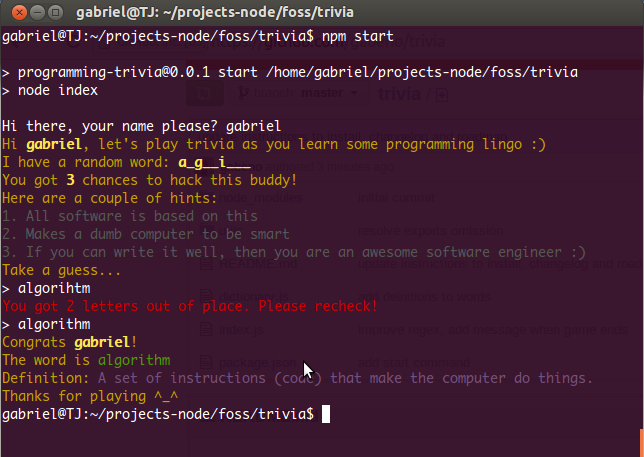

## Trivia

This is a simple **node CLI** game which I have made in the process of teaching myself programming. I love JavaScript hence the bias for the node environment.

## Installing and playing

    mkdir myDir
    git clone https://github.com/gabeno/trivia.git
    cd trivia
    npm start

## Contibuting

This is a very basic game and would definitely do with some improvements. Feel free to open an issue.

## Change log

- Wrote a better algorithm to obfuscate a word - [commit](https://github.com/gabeno/trivia/commit/2855ae5cd1edd4996337f595ead992d1751d266b)
- Intuitively set the number of chances for a player based on the difficulty of the word - [commit](https://github.com/gabeno/trivia/commit/55227687fe463e6ef9cc3ae9684a62770bd802d5)

## Roadmap

- Improve randomization of words in the dictionary which is currently implemented with a `Math.random()` function.
- An easier way to set new words. Also persist a set of words within a sandboxed application.
- Add a _play again_ behaviour/option so that game does not end after each word has been deciphered.
- Add tests and avoid this macho feeling that my software will just work.